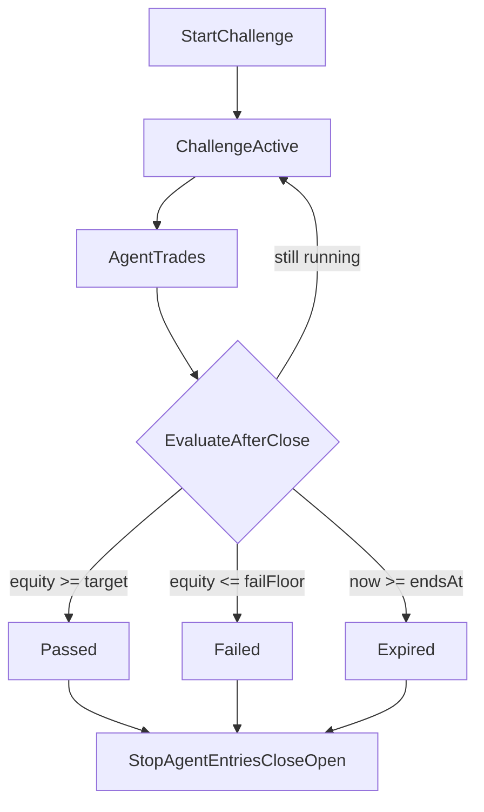

# Challenge Mode Plan

## Overview

Add a time-boxed, **single-agent** challenge layer (e.g. **$5 → $50 in 30 days**) with isolated P&L accounting, pass/fail evaluation, and optional **paper or live** execution—without disrupting normal trading when no challenge is active.

### Product decisions (confirmed)

| Decision | Choice |
|----------|--------|
| Scope | One agent per challenge |
| Execution | User picks **paper** or **live** per challenge |
| Example | Start $5, target $50, duration 30 days |

---

## What you want

A **single-agent challenge**: start with **$5**, target **$50** (10× / +900%), over **30 days**, with the user choosing **paper or live** per challenge.

Today the bot has no session concept—capital is global ([`capital/index.ts`](../capital/index.ts)), drawdown is calendar-month based ([`risk/index.ts`](../risk/index.ts)), and agents run indefinitely ([`index.ts`](../index.ts)). Challenge mode needs a **scoped session** that overrides capital and risk math for one agent only.



---

## 1. Data model (Prisma)

Add to [`prisma/schema.prisma`](../prisma/schema.prisma):

### `ChallengeSession`

| Field | Description |
|-------|-------------|
| `id` | Primary key |
| `agentId` | FK → Agent |
| `startingCapital` | e.g. 5 |
| `targetCapital` | e.g. 50 |
| `maxDrawdownPct` | Default **1.0** (lose entire starting capital) |
| `startsAt`, `endsAt` | 30-day window |
| `executionMode` | `'paper' \| 'live'` — independent of agent default |
| `status` | `'active' \| 'passed' \| 'failed' \| 'expired' \| 'cancelled'` |
| `endedAt` | When challenge ended |
| `finalEquity`, `finalReturnPct` | Snapshot at end |
| `failReason` | Optional audit string |
| `riskPercent`, `leverage` | Optional session overrides |

### `Trade.challengeId`

Nullable FK — tag trades opened during a challenge so P&L is isolated even after the challenge ends.

### Constraints

- At most one **active** challenge per agent (enforced in service layer; optional unique partial index).

Run migration after schema change.

---

## 2. Challenge service (new module)

Create [`challenge/index.ts`](../challenge/index.ts):

| Function | Purpose |
|----------|---------|
| `startChallenge(agentId, config)` | Validate agent exists, no active challenge, create session, notify |
| `getActiveChallenge(agentId)` | Load active session (cache-friendly) |
| `getChallengeEquity(session)` | `startingCapital + sum(realizedPnL)` for challenge trades + open unrealized |
| `evaluateChallenge(session)` | After each close + on hourly tick: pass / fail / expire |
| `endChallenge(session, status, reason)` | Set status, snapshot metrics, pause entries, optionally force-close open trade |
| `buildChallengeContext(session)` | `{ daysLeft, equity, returnPct, progressToTarget }` for prompts |

### Rules

- **Pass**: `equity >= targetCapital`
- **Fail**: `equity <= startingCapital * (1 - maxDrawdownPct)` (default: $0)
- **Expire**: `now >= endsAt` without pass → `expired`

### CLI (minimal UX)

`scripts/start-challenge.ts` or:

```bash
npm run challenge -- --agent-id=... --start=5 --target=50 --days=30 --mode=paper
```

---

## 3. Capital isolation (critical)

[`getPortfolio()`](../capital/index.ts) today sums **all agents'** closed P&L against one global balance. For challenge mode, add:

```ts
getChallengePortfolio(session: ChallengeSession): Promise<Portfolio>
```

- `totalValue = session.startingCapital + challengeScopedClosedPnL + openPositionExposure`
- Scope: `Trade.where({ challengeId: session.id })`
- **Do not** use `INITIAL_CAPITAL`, Bybit balance, or other agents' trades
- During active challenge, [`agents/index.ts`](../agents/index.ts) entry cycle calls `getChallengePortfolio` instead of `getPortfolio` for that agent

**Live mode**: execution still hits Bybit, but **sizing and evaluation** use the challenge sandbox ($5 notional). Document that live challenges require accepting real-money risk on that slice; paper is the safe default.

**Tagging at entry**: in [`execution/index.ts`](../execution/index.ts) `executeEntry`, set `challengeId` on the created `Trade` when the agent has an active challenge.

---

## 4. Risk overrides for challenge context

Extend [`getDrawdownState`](../risk/index.ts) and [`validateEntrySignal`](../risk/index.ts) to accept optional `ChallengeContext`:

| Global rule today | Challenge behavior |
|-------------------|-------------------|
| Monthly/daily caps vs full portfolio | **Challenge-relative** P&L %: `(equity - starting) / starting` |
| `PerformanceMode` from calendar month | Derive from **challenge progress** (behind pace → CONSERVATIVE; ahead → GROWTH) |
| 10% monthly drawdown cap | Use `maxDrawdownPct` on challenge capital only |

Add block reasons to [`types/risk.types.ts`](../types/risk.types.ts):

- `CHALLENGE_ENDED`
- `CHALLENGE_FAILED`
- `CHALLENGE_TARGET_HIT` (block new entries after terminal state)

### Guard in agent loop

Top of `processSignificantCandle` / `runEntryCycle` in [`agents/index.ts`](../agents/index.ts):

```ts
const challenge = await getActiveChallenge(agent.id);
if (challenge && challenge.status !== 'active') return;
if (challenge && Date.now() >= challenge.endsAt.getTime()) {
  await endChallenge(challenge, 'expired', 'Time limit reached');
  return;
}
```

### Execution mode override

When a challenge is active, route through `session.executionMode` (`paper` → paper entry, `live` → live path) regardless of the agent's stored `mode`. Prefer **session override** so agent config is not mutated.

---

## 5. Prompts and behavior

Extend [`claude/prompts.ts`](../claude/prompts.ts) `buildEntryPrompt` / `buildPortfolioContext` with a challenge block when context is present:

- Starting capital, current equity, target, days remaining
- Required pace to hit target (900% / 30 days ≈ very aggressive; LLM should know this)
- Optional "lock-in" sub-mode after target hit (capital preservation only)

Optional **`CHALLENGE` performance mode** or reuse `GROWTH` with session `riskPercent` override (e.g. 2–3% vs default 1%).

---

## 6. Lifecycle hooks

| Event | Action |
|-------|--------|
| Challenge start | Telegram notify; optional session-only `riskPercent` bump |
| Each trade close | `evaluateChallenge()` in [`execution/index.ts`](../execution/index.ts) `closeTrade` |
| Hourly | Re-evaluate active challenges for expiry |
| Pass / fail / expire | Notify; set agent `status = 'paused'`; clear triggers; close open challenge trade if configured |
| Bot restart | Challenge loaded from DB on first agent tick |

---

## 7. Reporting

Persist final snapshot on `ChallengeSession` (`finalEquity`, `finalReturnPct`, `failReason`).

Optional result JSON (mirror [`backtest/index.ts`](../backtest/index.ts)): win rate, max drawdown, trade count, days to pass/fail.

Telegram templates in [`utils/notifications.ts`](../utils/notifications.ts): `challengeStarted`, `challengePassed`, `challengeFailed`, `challengeExpired`.

---

## 8. Files to touch (implementation order)

1. [`prisma/schema.prisma`](../prisma/schema.prisma)
2. [`types/challenge.types.ts`](../types/challenge.types.ts)
3. [`challenge/index.ts`](../challenge/index.ts)
4. [`capital/index.ts`](../capital/index.ts)
5. [`risk/index.ts`](../risk/index.ts)
6. [`types/risk.types.ts`](../types/risk.types.ts)
7. [`execution/index.ts`](../execution/index.ts)
8. [`agents/index.ts`](../agents/index.ts)
9. [`claude/prompts.ts`](../claude/prompts.ts)
10. [`utils/notifications.ts`](../utils/notifications.ts)
11. [`scripts/start-challenge.ts`](../scripts/start-challenge.ts) + `package.json` script
12. [`.env.example`](../.env.example) / [`README.md`](../README.md)

### Out of scope for v1

- UI dashboard
- Multiple concurrent challenges per user
- Challenge template library
- Backtest-as-challenge replay

---

## 9. Realistic expectations ($5 → $50)

With default **1% risk per trade** and **10× leverage**, hitting 10× in 30 days requires an exceptional win streak. For challenge mode to be *attemptable* (not guaranteed):

- Allow session-level **`riskPercent` override** (e.g. 2–5%)
- Use challenge-scoped drawdown instead of global 10% monthly cap
- Keep pass/fail deterministic on **realized equity**, not LLM optimism

**Paper challenges** = strategy stress-testing. **Live challenges** = only capital you can afford to lose entirely.

---

## 10. Test plan

1. Start paper challenge on one agent ($5 / $50 / 30d)
2. Confirm position size uses ~$5 base, not `INITIAL_CAPITAL=1000`
3. Close a winning trade → equity updates; progress in prompt/logs
4. Simulate pass → entries blocked, notification sent
5. Simulate fail (equity → $0) → same
6. Let `endsAt` pass without target → `expired`
7. Restart bot mid-challenge → state restores from DB
8. Live challenge smoke test on testnet with small real slice

---

## Implementation checklist

- [ ] Add `ChallengeSession` model + `Trade.challengeId` to Prisma and migrate
- [ ] Create `challenge/index.ts` (start, evaluate, end, equity, context)
- [ ] Add `getChallengePortfolio` + challenge-aware `getDrawdownState` / `validateEntrySignal`
- [ ] Wire challenge guards and context through `agents/index.ts` entry cycle
- [ ] Tag trades with `challengeId`, evaluate on close, honor session `executionMode`
- [ ] Challenge prompt block + Telegram notifications + `start-challenge` script
